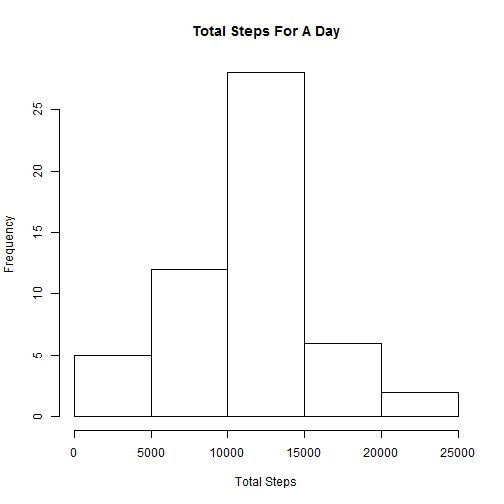
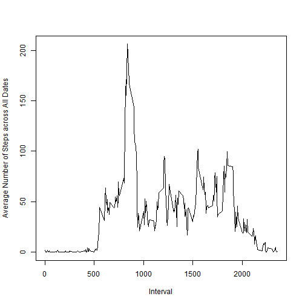
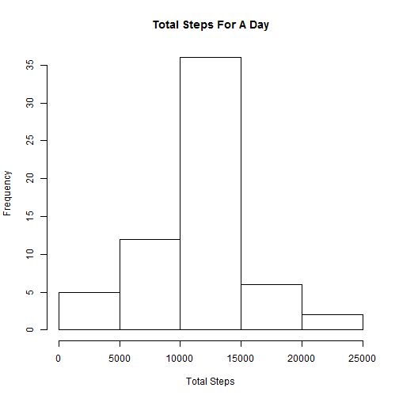
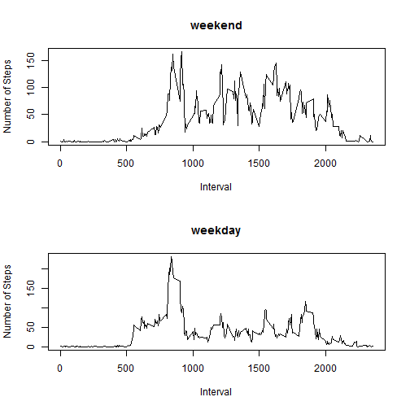

This is the R markdown file for the Peer Assessment 1 of Preproducible Research course.

## Loading and preprocessing the data

The first part of the code reads in the activity monitoring data.  

The dataset activity.csv file already exists in the working directory. The following code chunks read in the CSV file and preprocess the date column of the dataset.  


```r
options(scipen = 1)
activityData <- read.csv("./activity.csv", header = TRUE, colClasses = c("numeric", "character", "numeric"))
activityData$date <- as.Date(activityData$date, "%Y-%m-%d")
```

## What is mean total number of steps taken per day?

This section aggregates the number of steps taken during each day. A histogram is then made to visualise the distribution of "Number of Steps Taken Per Day".


```r
StepsPerDay <- aggregate(steps ~ date, data = activityData, sum)
hist(StepsPerDay$steps, main = "Total Steps For A Day", xlab = "Total Steps")
```

 

```r
MeanStepsPerDay <- mean(StepsPerDay$steps)
MedianStepsPerDay <- median(StepsPerDay$steps)
```

The mean of "Number of Steps Taken Per Day" across all dates is calculated to be 10766.1886792  
The median of "Number of Steps Taken Per Day" across all dates is calculated to be 10765

## What is the average daily activity pattern?

The number of steps per 5-step interval are averaged across all the days. A time series plot is then made to visualise the trend of steps taken against the 5-minute intervals.


```r
AveStepsPerInterval <- aggregate(steps ~ interval, data = activityData, mean)
with(AveStepsPerInterval, plot(interval, steps, type = 'l', xlab = "Interval", ylab = "Average Number of Steps across All Dates"))
```

 

```r
MaxStepsInterval <- AveStepsPerInterval[AveStepsPerInterval$steps == max(AveStepsPerInterval$steps), 1]
```

The 5-minute interval: 835, contains the maximum number of steps averaged across all the days.

## Imputing missing values

This section will first investigate the missing values in the dataset.


```r
NumberNA <- nrow(activityData[is.na(activityData$steps), ])
```

The total number of missing values in the dataset is: 2304  

Now we'll replace the missing "number of steps" measurement value with the mean "number of steps" for the corresponding 5-minute interval. A new dataset "activityData_Imputed" is used to store these processed values.  

A new histogram is then plotted to visualise the changed distribution of "Number of Steps Taken Per Day".


```r
activityData_Imputed <- activityData
# Find the indices of these NA values within the AveStepsPerInterval
index <- match(activityData_Imputed[is.na(activityData_Imputed$steps), ]$interval, AveStepsPerInterval$interval)
activityData_Imputed[is.na(activityData_Imputed$steps), ]$steps <- AveStepsPerInterval[index, ]$steps
StepsPerDay_Imputed <- aggregate(steps ~ date, data = activityData_Imputed, sum)
hist(StepsPerDay_Imputed$steps, main = "Total Steps For A Day", xlab = "Total Steps")
```

 

```r
MeanStepsPerDay_Imputed <- mean(StepsPerDay_Imputed$steps)
MedianStepsPerDay_Imputed <- median(StepsPerDay_Imputed$steps)
```

There is slight changes in the histogram where the central bar (between 10,000 and 15,000 steps) is higher than the previous plot. This is because now there are more days (with missing step measurement values originally) fall within the central bar (between 10,000 and 15,000 steps).  

The new mean of "Number of Steps Taken Per Day" across all dates is calculated to be 10766.1886792  
The new median of "Number of Steps Taken Per Day" across all dates is calculated to be 10766.1886792  

There is no change to the mean value but the new median value is now equal to the mean value. Due to the missing values replacement, there are now more "number of steps" readings taking the average values. Hence the median value tend towards the mean value.

## Are there differences in activity patterns between weekdays and weekends?

The following section adds a new factor column "weekday" to the dataset. The number of steps per 5-step interval are then averaged across all weekdays and all weekends respectively.  

Lastly, two time-series plot are created to visualise the trend of steps taken against the 5-minute intervals (during weekdays and weekends).


```r
activityData_Imputed$day <- weekdays(activityData_Imputed$date)
activityData_Imputed$weekday <- as.factor(ifelse(activityData_Imputed$day %in% c("Saturday", "Sunday"), "weekend", "weekday"))
AveStepsPerInterval_Imputed <- aggregate(steps ~ weekday + interval, data = activityData_Imputed, mean)
par(mfcol = c(2, 1))
with(AveStepsPerInterval_Imputed[AveStepsPerInterval_Imputed$weekday == "weekend", ], plot(interval, steps, type = 'l', xlab = "Interval", ylab = "Number of Steps", main = "weekend"))
with(AveStepsPerInterval_Imputed[AveStepsPerInterval_Imputed$weekday == "weekday", ], plot(interval, steps, type = 'l', xlab = "Interval", ylab = "Number of Steps", main = "weekday"))
```

 

From the two plots, it can be observed that the number of steps taken during weekend daytime (between 1000 and 2000) is higher than weekday daytime. This could be due to that participants perform more activities during weekends.
